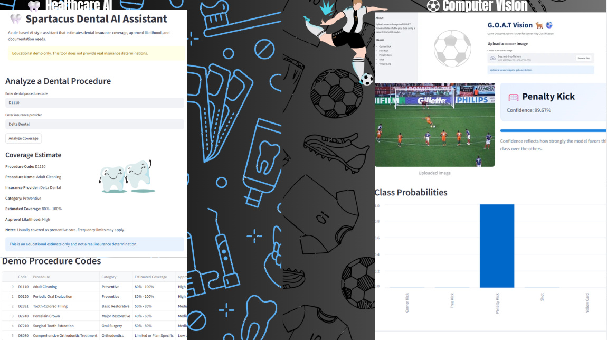
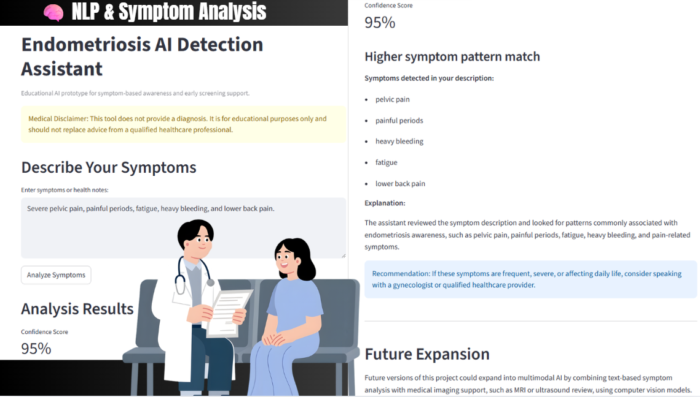

# Samira-Gevara-AI-Portfolio
Applied AI Portfolio - Houston City College | AI &amp; Robotics

## About Me
I am an Applied AI & Robotics student at Houston City College with a focus on building practical, real-world AI solutions. My work combines machine learning, computer vision, and natural language processing to solve problems in healthcare, sports analytics, and business automation.

I am especially interested in AI applications that improve decision-making, accessibility, and efficiency in real-world environments.

---

## 🚀 Featured Projects

| Project | Focus Area |
|---|---|
| ⚽ G.O.A.T Vision | Computer Vision |
| 🦷 Spartacus | Healthcare AI + Workflow Automation |
| 🧠 Endometriosis AI | NLP + Healthcare AI |

---

## Technical Skills & Tools

- Python
- PyTorch
- TensorFlow
- Streamlit
- Machine Learning
- Deep Learning
- Computer Vision
- Natural Language Processing (NLP)
- GitHub
- Google Colab

---

## Featured Projects

### ⚽ G.O.A.T Vision – Soccer Play Classifier
CNN-based computer vision system that classifies soccer plays using PyTorch and Streamlit.

🔗 Repository:
https://github.com/samirag2010/ITAI-1378-Midterm-GOATVision-PlayClassifier

---

### 🦷 Spartacus Dental AI Assistant
AI-assisted dental insurance decision support system designed to estimate coverage and streamline workflow automation.

🔗 Repository:
https://github.com/samirag2010/spartacus-dental-ai

---

### 🧠 Endometriosis AI Detection Assistant
Healthcare-focused NLP project exploring AI-assisted symptom analysis and explainable healthcare decision support.

🔗 Repository:
https://github.com/samirag2010/Endometriosis-AI

---

## Courses & Learning Journey

### Computer Vision AI (ITAI 1378)
Focused on image classification, dataset creation, and model deployment using PyTorch and Streamlit.

### Natural Language Processing (ITAI 2373)
Worked on prompt engineering, AI assistants, and text-based model applications.

### AI in Cybersecurity (ITAI 1372)
Explored secure AI deployment, prompt injection risks, and cloud-based AI systems using Google Cloud.

---

## Current Focus

I am currently focused on expanding my experience in applied AI, healthcare AI systems, computer vision, NLP, and AI workflow automation while continuing to build real-world portfolio projects.

## What I’m Building Next

- Deploying interactive AI applications with real-world usability
- Expanding healthcare AI and workflow automation systems
- Advancing my skills in computer vision, NLP, and intelligent decision support systems

---

## Contact

- Email: Samirad2012@hotmail.com
- GitHub: https://github.com/samirag2010
- LinkedIn: 

---

## Portfolio Goal

This portfolio represents my journey in applied AI, focusing on building systems that solve real problems. I am actively seeking opportunities to grow in AI, machine learning, and cybersecurity.
